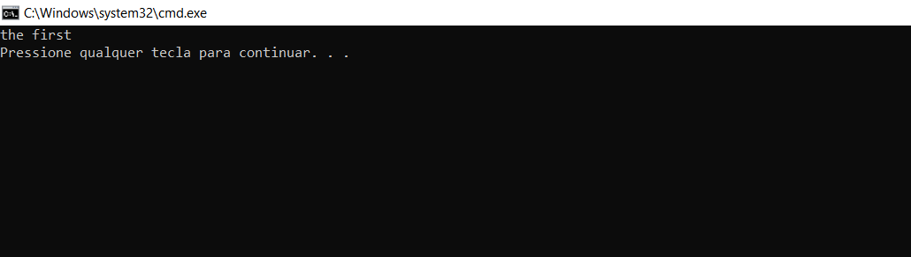

## Uma Breve História

C++ é uma das linguagens mais populares e tem sido usada para o desenvolvimento de muitos aplicativos amplamente utilizados. Embora seja uma das linguagens de programação mais antigas, C++ é constantemente classificada entre as linguagens de programação mais usadas e poderosas. C++ não é especializada para um campo de aplicação específica, pelo contrário, é usada para uma gama impressionante de aplicações. Por exemplo, C++ é amplamente usado para desenvolver aplicativos de jogos, aplicativos da Web, sistemas operacionais, aplicativos de rede, financeiros, navegadores, compiladores, sistemas incorporados e muito mais. Um grande número de aplicativos populares que todos nós usamos em nossa vida diária são escritos em C++. Além disso, é mais eficaz do que muitas outras linguagens para desenvolver aplicativos em uma variedade diferente de sistemas e ambientes de computação, como computadores pessoais, estações de trabalho, tablets e telefones celulares.

C++ originalmente deriva de C, que foi desenvolvido no Bell Labs no início dos anos 1970 por Dennis Richie e outros. A rápida expansão da linguagem C e sua crescente popularidade levaram muitas empresas a desenvolver seus próprios compiladores C. No entanto, devido à ausência de um padrão oficial, recursos que não foram claramente descritos podem ser implementados de diferentes maneiras. Como resultado, o mesmo programa pode ser compilado com um compilador C e não com outro. Paralelamente, a linguagem C continuou a evoluir com a adição de novos recursos e a substituição ou obsolescência dos existentes. A necessidade de padronização da linguagem C tornou-se evidente. Em 1983, o American National Standard Institute (ANSI) iniciou o desenvolvimento do padrão C que foi concluído e formalmente aprovado, em 1989, como ANSI C ou Standard C. O padrão ANSI C também define uma biblioteca que toda implementação ANSI C deve suportar. C++ também suporta essa biblioteca.

O design e desenvolvimento de C++ começou no Bell Labs no início dos anos 80 por Bjarne Stroustrup como uma extensão da linguagem C. Stroustrup teve vários motivos para basear C++ em C, como a brevidade do C, alto desempenho, portabilidade e ampla popularidade. Na verdade, o nome C++ vem do operador de incremento C++, que incrementa o valor de uma variável em um. De acordo com Stroustrup, o nome significa a natureza evolutiva das mudanças de C.

Essencialmente, com algumas exceções, C++ é um superconjunto de C. C é uma linguagem relativamente simples. Seus principais componentes são control flows, iterations, arrays, pointers, functions, and structures. Estas são as ferramentas básicas disponíveis para um programador C escrever programas. Em C++, as ferramentas são bem mais amplas. No nível conceitual, os recursos mais importantes adicionados são ocultação de dados, polimorfismo, herança, suporte a programação genérica e a biblioteca padrão que fornece um grande número de ferramentas ao desenvolvedor. No nível de design, C++ suporta programação procedural baseada no uso de fluxos de controle, instruções de iteração e chamadas para funções para executar um conjunto de ações quando chamadas, programação abstrata baseada no design de tipos que oculta detalhes de implementação, programação orientada a objetos baseada no desenho de hierarquias de classes e objetos que representam as entidades com as quais o programa lida, e programação genérica baseada no uso de templates e algoritmos genéricos que permitem ao programador escrever código independente de tipo. A capacidade de combinar todas essas técnicas de design de programação ao escrever programas destaca a flexibilidade e a força do C++. Sim, eu diria serviços de programação suficientes para uma única linguagem.

Além disso, um dos principais objetivos do C++ é continuar próximo ao hardware como o C, fornecendo uso eficiente de memória e alto desempenho de funções de baixo nível, além de permitir que o desenvolvedor defina tipos próprios com o mesmo suporte de sintaxe, faixa de aplicação e desempenho com os tipos básicos. Essa combinação permitiu a disseminação do C++.

O C++ começou a se difundir e, como no caso do C, foi necessária a publicação de um padrão para descrever suas características. O C++ foi inicialmente padronizado em 1998 como ISO/IEC 14882:1998, que foi então alterado pelos padrões C++03, C++11, C++14 e C++17. O C++03 foi principalmente uma revisão técnica do C++98, visando corrigir bugs e reduzir ambiguidades. Como o C++03 não adicionou novos recursos, o C++98 é frequentemente chamado de C++98/C++03. As próximas versões adicionam novos recursos ao idioma. O C++ ainda continua a evoluir e, no momento da redação deste artigo, o C++20 está em andamento.

Este livro cobre completamente o C++98 e apresenta vários recursos do C++11/C++14/C++17. Quaisquer referências a C++11/C++14/C++17 são claramente identificadas. Eu poderia descrever a linguagem de forma uniforme sem nenhuma referência especial aos padrões, apenas preferi a distinção para leitores que possam ter alguma experiência com C++98 e gostariam de ver as mudanças separadamente, bem como por motivos históricos, para mostrar a evolução da linguagem e as necessidades que um novo recurso cobre. Além disso, como você pode encontrar um código que usa recursos mais antigos que podem ter sido removidos até agora, é útil saber como eles funcionam para poder ler esse código. Este livro pressupõe que você não tenha conhecimento prévio de C. Qualquer referência a C refere-se a ANSI C e não a versões posteriores. Caso você conheça C, é uma boa oportunidade para refrescar sua memória e testar novamente suas habilidades.

Observe que este livro não pretende ser uma referência C++ completa; uma cobertura detalhada está além de seu escopo. O objetivo principal é apresentar os conceitos fundamentais da linguagem C++ e mostrar como aplicá-los em seus programas através de muitos exemplos e exercícios de programação.

## Nosso primeiro programa em C++
___

Nosso primeiro programa será uma versão "rock" do programa que a maioria dos programadores começam. Ao invés da clássica mensagem *hello world*, nosso primeiro programa exibe na tela o clássico som dos *Ramones*: *Hey Ho, Let's Go*.  

```c++
#include<iostream>
int main()
{
  std::cout << "Hey Ho, Let's Go\n";
  return 0;
}
```
Antes de explicarmos as linhas do programa, vamos discutir brevemente a biblioteca padrão.

### Biblioteca Padrão

A palavra *biblioteca* refere-se a uma coleção de recursos de software (por exemplo, funções), geralmente escritos por outros, que podemos usar em nossos programas. A biblioteca padrão ocupa grande parte do C++ standard e fornece uma grande coleção de componentes que facilitam o trabalho do programador. Por exemplo, a classe *string* é um desses componentes e torna mais fácil para o programador gerencia-lás. Todo compilador C++ deve suportar a biblioteca padrão.

A biblioteca padrão é definida em um namespace separado, que se chama *std*. Falaremos sobre namespaces em breve. Os serviços da biblioteca padrão (por exemplo, exibir dados na tela) são fornecidos por meio de arquivos especiais, esses arquivos são normalmente chamados de arquivos de cabeçalho (*header files*) e são fornecidos com o compilador. Um deles é o *iostream*; Como dissemos, a biblioteca C++ inclui a biblioteca C, para cada arquivo de cabeçalho *X.h* da biblioteca C existe o cabeçalho *cX* correspondente na biblioteca C++. A letra c indica que o arquivo de cabeçalho faz parte da biblioteca C. Por exemplo, o arquivo correspondente de *stdio.h* é o arquivo *cstdio*. Embora seu conteúdo possa ser o mesmo, o formato *cX* é mais adequado para programas C++. Em particular, a inclusão do arquivo *cX* coloca os nomes definidos neste arquivo no namespace *std*. Observe que você pode ler programas que incluem o arquivo *iostream.h* em vez de *iostream. iostream.h* que é uma versão mais antiga do *iostream* e não é mais compatível com o padrão C++.

### A Diretiva #include

C++ usa um programa de software chamado pré-processador. O pré-processador normalmente faz parte do compilador e sua função é processar o programa antes de ser compilado. O pré-processador comunica-se com o compilador por meio de diretivas. Uma diretiva de pré-processador instrui o compilador a agir de acordo. Por exemplo, com a diretiva __#include__, o pré-processador instrui o compilador a incluir o conteúdo do arquivo *iostream* no programa antes de ser compilado. Com relação à sintaxe, as diretivas sempre começam com o caractere # e não terminam com ponto e vírgula (;) ou algum outro marcador especial. Veremos mais diretivas de pré-processador no Capítulo 15.

O arquivo *iostream* onde a letra __i__ corresponde ao *input* e __o__ ao *output*, contém informações sobre classes e funções necessárias para ler e exibir dados. Se não incluirmos este arquivo, o compilador não reconhecerá o *cout* e a compilação falhará. Para incluir um arquivo da biblioteca padrão  como *iostream*, colocamos o nome do arquivo entre colchetes <>. Um arquivo incluído também pode conter diretivas __#include__ e incluir outros arquivos. Em geral, quando estamos usando componentes da biblioteca padrão em nosso programa, devemos incluir os arquivos de cabeçalho correspondentes. Por exemplo, se estivermos usando a classe *string*, precisamos incluir o arquivo *string*. A ordem em que os arquivos são incluídos não importa; A prática comum é colocar as diretivas __#include__ no início do arquivo.

Quando você se familiarizar com o C++, você pode editar seus próprios arquivos de cabeçalho e incluí-los em seus programas. Para incluir seu próprio arquivo de cabeçalho, coloque seu nome entre aspas duplas ("").

Quando o programa é compilado, o compilador procura os arquivos incluídos. As regras de busca dependem da implementação. Normalmente, se o nome do arquivo estiver entre <>, o compilador pesquisa em diretórios predefinidos que contêm os cabeçalhos da biblioteca padrão. Se estiver entre aspas duplas (""), o compilador geralmente começa com o diretório que contém o arquivo de origem e, em seguida, pesquisa os diretórios predefinidos. Se o arquivo não for encontrado, o compilador produzirá uma mensagem de erro e a compilação falhará. O nome do arquivo pode incluir informações relativas ou completas do caminho. Por exemplo:

```
#include "d:\projects\serial.h" // DOS/Windows path.
#include "/usr/include/serial.h" // Linux/Unix path.
#include "..\projects\test.h" // Relative path.
```
No entanto, seria melhor evitar incluir informações de path ou drive, pois se seu programa for transferido para outro sistema, sua compilação poderá falhar.

Depois de se familiarizar com o C++, você pode abrir os arquivos incluídos (por exemplo, iostream) e lê-los. Não confie neles apenas como fonte de algum conhecimento místico que esconde segredos invisíveis. São arquivos de texto que existem em seu computador. Encontre-os e veja seu conteúdo. É uma excelente fonte de conhecimento e informação extra.


### A Função main()

Cada programa em C++ deve conter uma função chamada *main()*. A palavra *main()* deve ser escrita em caracteres minúsculos. O código do programa, ou então o corpo da função, deve estar entre chaves ({}). Um statement é um comando que será executado quando o programa for executado. Os statements são normalmente escritas em linhas separadas e, quase sempre, cada statement termina com um ponto e vírgula. Embora o compilador não se importe com o layout do programa, a indentação e o espaçamento adequados tornam seu programa mais fácil de ler. Braces(chaves) são usadas para agrupar declarações e instruções em um bloco ou então uma instrução composta que o compilador trata como uma. Além das funções, usaremos chaves em instruções de controle e loops.

O *main()*, como o próprio nome indica, é a função principal de qualquer programa. Falaremos sobre funções no Capítulo 11. Simplificando, uma função é uma série de declarações e comandos que foram agrupados e receberam um nome (por exemplo, main()). Uma função é chamada pelo seu nome para realizar uma tarefa específica e pode, opcionalmente, retornar um valor. A função *main()* é chamada automaticamente pelo sistema operacional quando o programa é executado. A execução do programa começa com a primeira instrução de *main()* e termina quando a última instrução de *main()* é executada, a menos que uma instrução de saída (por exemplo, __return__ ) seja chamada anteriormente. Obviamente, se ocorrer um erro grave durante a execução do programa, como uma divisão por 0, o programa terminará de forma anormal. A palavra-chave __int__ indica que *main()* deve retornar um integer ao sistema operacional quando terminar. Esse valor é retornado com a instrução __return__; o valor 0 indica terminação normal, enquanto valores diferentes de zero indicam algum tipo de falha. Esta declaração de *main()* é bastante comum. No entanto, você pode ver outras declarações, como:

```c++
void main
```

Como veremos no Capítulo 11, a palavra-chave __void__ indica que *main()* não retorna nenhum valor. Embora um compilador C++ possa aceitar essa declaração, ela não está em conformidade com o padrão porque *main()* deve retornar um valor. Outra declaração comum é:

```c++
int main(void)
```

A palavra __void__ afirma explicitamente que *main()* não aceita parâmetros; no entanto, seu uso é desnecessário porque os parênteses vazios () indicam o mesmo. No Capítulo 11, veremos outra declaração de *main()*, no qual *main()* recebe parâmetros. Observe que a instrução __return__ pode ser omitida. Se for omitida, o programa retornará automaticamente o valor 0. Embora o resultado seja o mesmo, minha preferência é usar a instrução __return__ para que seja claramente mostrada.

_cout_ é um objeto que é declarado no namespace *std* e está associado à saída padrão predefinida (por exemplo, tela). *cout* sabe como exibir uma variedade de dados, incluindo strings, números e caracteres individuais. Em C++, uma série de caracteres entre "" é chamada de *string literal*. A notação ≪ indica que a string é enviada para *cout*. Como veremos no Capítulo 3, o caractere de nova linha *\n* move o cursor para o início da próxima linha. A principal razão pela qual eu adiciono *\n* no final da string é que mensagens como Pressione qualquer tecla para continuar, que podem ser exibidas por alguns compiladores após o término do programa, aparecem na próxima linha.

### Estilos de Escrita

Em relação à sintaxe do programa, as chaves {} não precisam ser colocadas em linhas separadas. Por exemplo, podemos adicionar o {next to *main()* e escrever *main()*{ or the} próximo à instrução __return__. Além disso, não é necessário recuar o código. Como você pode imaginar, há muitas maneiras de escrever o programa. Por exemplo, poderíamos escrever *main()*{ e colocar o código em uma única linha grande; no entanto, essa opção tornaria nosso programa ilegível. Uma linha pode conter várias instruções. Por exemplo, é legal escrever:

```c++
std::cout << "Hey Ho, Let's Go\n"; return 0;
```

Além das preferências que qualquer um possa ter, o que realmente importa é que um programa seja escrito de tal forma que seja fácil de ler não só por quem o escreveu, mas também por outros que vão lê-lo. Para melhor legibilidade, o estilo de escrita que prefiro é sempre colocar o {} em linhas separadas, cada instrução em uma linha e recuar o código.

### Namespaces 

Vamos fazer uma breve introdução aos namespaces. C++ permite o agrupamento de dados (por exemplo, classes, funções, variáveis, …) em um namespace comum. Assim, o namespace é uma parte do programa, no qual determinados nomes (por exemplo, variáveis) são declarados. Esses nomes não são conhecidos fora desta área. Por exemplo, todos os nomes da biblioteca padrão são definidos em um namespace chamado *std*. Como veremos no Capítulo 25, para acessar um elemento do namespace, devemos escrever o namespace seguido do operador de resolução de escopo *::*. Por exemplo, quando escrevemos *std::cout*, acessamos o objeto *cout* que está declarado no namespace *std*. Se quisermos disponibilizar todos os nomes do namespace *std*, escrevemos:

```c++
 using namespace std;
```

Agora, não precisamos adicionar o prefixo *std::* antes dos nomes que usamos, ou seja, podemos escrever:

```c++
cout << "Hey Ho, Let's Go\n";
```

Alternativamente, podemos disponibilizar apenas os nomes que usamos. Isso é obtido usando declarações __using__ correspondentes. Por exemplo:

```c++
 using std::cout;
```

Agora, não precisamos adicionar o prefixo *std::* quando usamos o *cout*, enquanto temos que adicioná-lo ao usar outros nomes de *std*. A convenção que costumo seguir é colocar declarações __using__ separadas para os nomes que uso ou, se esses nomes não aparecerem muitas vezes no programa, use o prefixo, como fiz no primeiro programa com *std::*. A razão pela qual eu prefiro usar declarações __using__ separadas em vez de todo o namespace é deixar claro quais elementos eu uso desse namespace. Ocasionalmente, se os nomes utilizados forem muitos, para maior facilidade de escrita e leitura do código, disponibilizarei todo o namespace. Se em alguns programas eu declaro o *std* inteiro, embora os nomes não sejam muitos, é para formatar as páginas deste livro para salvar algumas linhas. Falaremos mais sobre namespaces no Capítulo 25. Por enquanto, basta saber que com os namespaces C++ permite que espaços diferentes contenham elementos (por exemplo, variáveis) com os mesmos nomes, que podem ser usados ​​no programa sem criar um conflito entre eles.

### Adicionando Comentários 

Adicionar comentários melhora a legibilidade do programa e facilita a compreensão de como ele funciona. Um comentário começa com // e termina no final da linha. O compilador ignora os comentários, portanto os comentários não aumentam o tamanho do arquivo executável, não afetam a operação do programa, nem aumentam o tempo de execução. Por exemplo, dois comentários são adicionados:

```c++
// O programa exibe uma mensagem na tela.
#include <iostream>
using std::cout; // Vamos usar o cout object.

int main()
{
  cout << "Hey Ho, Let's Go\n";
  return 0;
}
```

C++ também suporta o uso de / * * / para inserir comentários. O compilador ignora qualquer coisa incluída entre o / * * /. Se um comentário se estender por mais de uma linha, podemos usar // no início de cada linha ou / * * /. É uma questão de preferência pessoal. Minha preferência é usar // para comentários de uma linha, enquanto usar / * * / para várias linhas. Por exemplo:

```s
/ * O propósito do primeiro programa é exibir uma na tela. * /
```
Comentários não corretos não são permitidos, o código a seguir é ilegal e o compilador gerará uma mensagem de erro:

```s
/ *
/ * Outro comentário. * /
* /
```
Adicionar comentários é uma obrigação ao escrever programas. Um programa explicativo economiza tempo e esforço quando você precisa modificá-lo e o tempo de outras pessoas que podem precisar entender e evoluir seu programa. A pessoa que provavelmente se beneficiará dos comentários é você, quando voltar a esse código em algum momento no futuro e não se lembrar exatamente por que escreveu o código da maneira que fez. Na verdade, já me arrependi muitas vezes no passado quando em partes não óbvias dos meus programas eu não adicionava comentários, porque achava que sempre entenderia o que estava escrevendo. Eu estava errado e paguei o preço com o tempo que perdi para entender o que fiz.

Por outro lado, li comentários que tornaram mais difícil para mim entender as intenções do programador. Melhor não coloca-lás. Além dos pontos complicados do programa, sugiro que você adicione comentários para descrever a finalidade de cada arquivo, bem como a finalidade de funções, entidades (por exemplo, classes) ou variáveis importantes (por exemplo, global). E, ao adicionar um comentário, não se apresse em anotá-lo para continuar escrevendo o código. É muito importante que o comentário seja substancial, explicativo e compreensível.

Vamos fazer um exercício. Com base no que você aprendeu até agora, você pode me dizer o que o programa a seguir produz? Leia o programa com atenção e não se apresse para ver a resposta.

```s
#include <iostream> // Example 1.1
using std::cout;
int main()
{
//   cout << "That is ";
     cout << "the first"; / * Um programa com múltiplos outputs
     cout << " trap"; / * Esse é o último. * /
return 0;
}
```
Você notou o / / e respondeu a primeira *the first trap*? Sim, mas você não percebeu que o comentário que começa com / * na segunda linha termina no final da terceira linha. Portanto, o programa gera: *the first*.

```c++
#include <iostream> // Example 1.1
using std::cout;
int main()
{
//   cout << "That is "; 
     cout << "the first"; / * Um programa com múltiplos outputs
     cout << " trap"; / * Esse é o último. * /
return 0;
}
```


___



___

### Lendo Este Tutorial

Quanto às expressões linguísticas deste livro, eu diria que não há nada de especial. Se algum código estiver marcado como *program behaviour is undefined*, isso significa que o programa pode continuar a ser executado, travar ou produzir resultados inesperados. Todos os cenários são possíveis. Qual é o cenário mais provável? De acordo com a Lei de Murphy, trabalhar normalmente durante a fase de desenvolvimento e travar ao realizar uma demonstração pública. Além disso, mesmo que seu programa funcione normalmente com um compilador, ele pode falhar com algum outro ou com uma próxima versão do mesmo compilador. Portanto, evite o que pode causar um *undefined behaviour*.

Se algum código estiver marcado como *the result depends on the implementation* ou *it is platform dependent*, significa que se você compilar seu programa com outro compilador ou transferi-lo para outro sistema e compilar, esse código pode produzir resultados diferentes. Como você pode imaginar, depurar um programa que roda normalmente em um sistema e não em outro é um processo muito desagradável. Portanto, se você deseja que seu programa seja portátil, não escreva código que dependa do sistema em que você trabalha.

Na minha experiência, o primeiro passo para aprender uma linguagem de programação é através de exemplos de práticos. Você encontrará muitos exemplos ao longo deste livro. Alguns são apenas code snippets, enquanto outros são programas completos que ajudam a entender o material. Depois de entender (e não apenas ler) um tópico, o próximo passo é escrever o código para testar seu conhecimento. Você não pode aprender uma linguagem de programação apenas lendo um livro; você deve escrever o código. Por essa razão, cada capítulo oferece muitos exercícios de programação. Um programa pode ser escrito de várias maneiras. Ao ler um exercício, meu conselho é esconder a resposta e escrever sua própria versão. Em seguida, compare as soluções. Preste atenção extra a todas as perguntas do tipo “Qual é a saída do programa a seguir?” Não se apresse para ver a resposta; escondê-lo e dar-lhe algum tempo. Cada capítulo termina com uma série de exercícios não resolvidos para mais prática. Sempre experimente-os para testar suas habilidades e compreensão do que você aprendeu, antes de continuar para o próximo capítulo. Lembre-se, para aprender qualquer linguagem de programação, você deve escrever seus próprios programas e experimentá-los; mãos à obra, essa é a única maneira.

C++ *é uma linguagem poderosa com muitos recursos, regras e conceitos. Portanto, não fique desapontado se algum texto ou exemplos neste livro dificultarem sua compreensão. É normal se sentir assim. A melhor maneira de superar essas dificuldades é escrever programas pequenos e simples e experimentá-los para que você gradualmente se familiarize com os recursos da linguagem e como eles funcionam.*
